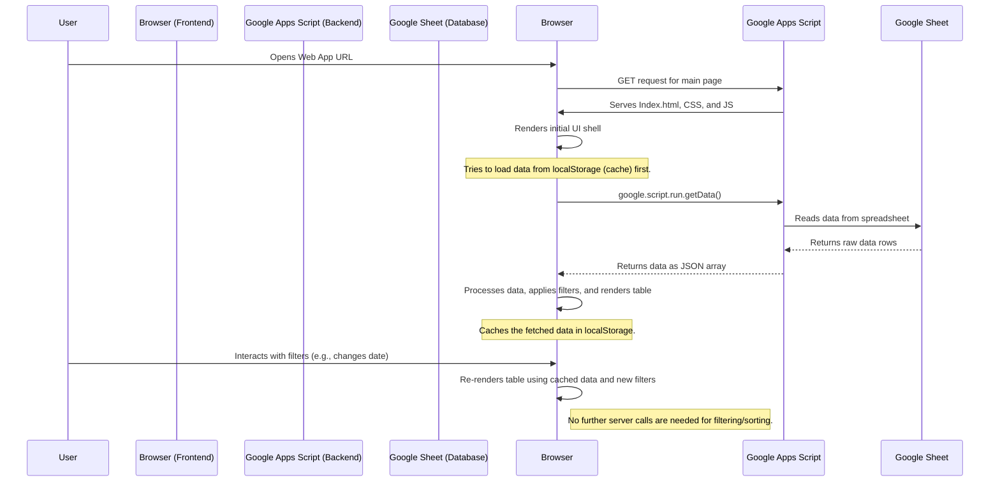

# Family Timeline Application

## 1. Overview

This project is a Google Apps Script web application designed to help users explore and analyze their family history. It presents a filterable and sortable timeline of family events, such as births, marriages, and other significant milestones. The primary goal is to provide a tool for dating old photographs and understanding family relationships and timelines by showing who was alive, their ages, and what events were occurring at any given point in time.

The application is built as a single-page web app that pulls data from a Google Sheet, making data management easy and accessible for the user. It is designed to be fast and responsive, with a focus on client-side logic and data caching.

## 2. System Architecture

The application follows a simple but effective architecture that separates the data source, the server-side logic, and the client-side presentation layer.

*   **Data Source (Google Sheets):** A standard Google Sheet acts as the database for the application. This is where all family event data and configuration (like level labels) are stored.
*   **Backend (Google Apps Script - `Code.js`):** A lightweight server-side script whose only job is to expose the data from the Google Sheet to the frontend. It does not perform any data processing.
*   **Frontend (HTML/CSS/JS):** The client-side code is the core of the application. It fetches all data from the backend on the initial load, caches it, and then handles all filtering, sorting, rendering, and user interactions directly in the user's browser.

### Data Flow Diagram

The following diagram illustrates the flow of data from the Google Sheet to the end-user.

## 3. File Structure

The project is composed of several files, each with a distinct role.

| File | Description |
| --- | --- |
| **`Code.js`** | Contains all the server-side Google Apps Script code. Its primary functions are `doGet()` to serve the web app and `getData()`/`getLevelLabels()` to fetch data from the Google Sheet. It acts as a simple data provider for the frontend. |
| **`Index.html`** | The main HTML file that defines the structure of the single-page application. It includes the filter controls, the data table container, and placeholders for the stylesheet and JavaScript files. |
| **`Javascript.html`**| This file contains all the client-side logic for the application, written in JavaScript and using the jQuery library. It handles fetching data, caching, filtering, sorting, rendering the table, and managing all user interactions. This is the "brain" of the application. |
| **`Stylesheet.html`**| Contains all the CSS styles for the application. It defines the layout, colors, fonts, and responsive design. It also includes specific styles for highlighting table rows and cells based on the data (e.g., for upcoming anniversaries). |
| **`appsscript.json`**| The manifest file for the Google Apps Script project. It defines project settings like the timezone, runtime version (V8), and error logging. |
| **`USER_GUIDE.md`** | A functional guide for end-users, explaining the features of the application and how to use them. It focuses on *what* the application does, not *how* it does it. |
| **`.clasp.json`** | A configuration file for `clasp`, the command-line tool for Google Apps Script. It links the local project files to a specific script project on Google Drive. |
| **PWA Files** | `manifest.html` and `service-worker.html` are used to enable Progressive Web App (PWA) features, allowing the app to be "installed" on a device and potentially work offline. |
| **`/icons`** | This directory contains the application icons used by the PWA manifest. |
